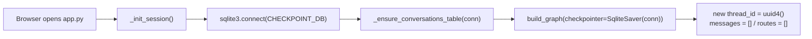
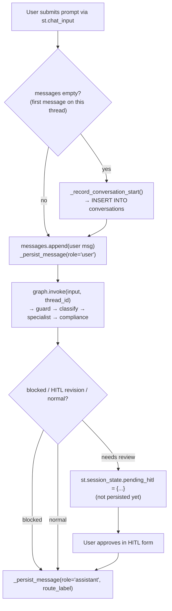
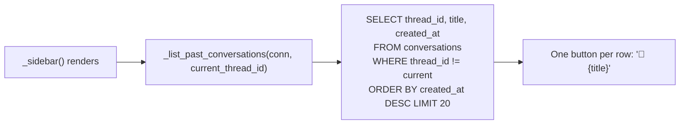
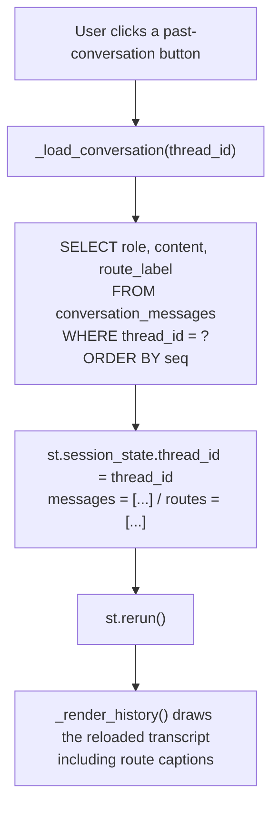

# Persistent Conversation History

Feature added in Session 15 (`app.py`). Lets a user start multiple conversations
in the Streamlit UI, switch between them via **New Conversation**, and come back
to any earlier one later — via a **Past Conversations** list in the sidebar —
without losing the transcript or the routing/compliance caption shown under
each assistant reply.

## Why this exists

Before this feature, `_init_session()` built the graph with `MemorySaver()`
(in-memory only), and the **New Conversation** button popped the `graph` object
itself. Both together meant every conversation vanished the moment you started
a new one, or the moment the app process restarted, with no way to look at it
again.

## Implementation changelog (for team reference)

**One file touched: `app.py`.** Nothing in `quickloan/config.py`, `nodes.py`,
`agent.py`, `tools.py`, `state.py`, or the graph/routing logic changed — this
was purely a Streamlit session/UI-layer fix, not an agent-behavior change.

| Area | Before | After |
|---|---|---|
| Checkpointer | `MemorySaver()` — in-process RAM only, gone on rebuild/restart | `SqliteSaver(conn)` on `data/checkpoints.db` — same file/pattern the CLI (`quickloan/agent.py::run()`) already used |
| "New Conversation" button | Popped `graph` itself → forced a brand-new empty `MemorySaver`, destroying every prior thread in that session | Only resets `thread_id`/`messages`/`routes` → `graph` and its DB connection stay alive, so no thread is destroyed |
| Browsing old conversations | Not possible — no listing UI existed at all | New **"Past Conversations"** sidebar section lists prior threads, newest first, clickable to reopen |
| Route/compliance captions on reopen | N/A (feature didn't exist) | Captured and restored via a new sidecar table, since they aren't part of the graph's own state |

### Specific additions in `app.py`

1. **New imports**: `sqlite3`, `datetime`/`timezone`, `CHECKPOINT_DB` (from `quickloan.config`), `SqliteSaver` (from `langgraph.checkpoint.sqlite`).
2. **Two new SQLite tables**, created on first run by `_ensure_conversations_table()`:
   - `conversations` — one row per thread (id, title, created_at), for the sidebar list.
   - `conversation_messages` — one row per message (thread_id, seq, role, content, route_label), the actual transcript + captions.
3. **Four new functions**:
   - `_persist_message()` — writes one message row.
   - `_record_conversation_start()` — writes a thread's title row on its first message.
   - `_list_past_conversations()` — reads the sidebar's list, excluding the currently active thread.
   - `_load_conversation()` — reads a thread's full transcript back into `st.session_state` when a past conversation is clicked.
4. **`_init_session()` rewritten** to open a persistent `sqlite3.connect(CHECKPOINT_DB, check_same_thread=False)` connection (stored as `st.session_state.db_conn`) and build the graph with `SqliteSaver(conn)` instead of `MemorySaver()`.
5. **`_sidebar()` updated**: "New Conversation" button behavior changed as above; new "Past Conversations" section added between it and the "Agents" list.
6. **`main()` and `_handle_hitl()` updated**: every point that appends a message to `st.session_state.messages` (user message, guard-blocked reply, normal reply, HITL-approved reply) now also calls `_persist_message()` so nothing is lost.

### Net effect
Conversations now survive clicking "New Conversation," reloading the page, and restarting the app/container (as long as `data/checkpoints.db` persists — e.g. via a mounted volume in Docker). Verified end-to-end with real usage: two real conversations recorded correctly, including a mid-conversation follow-up question and their original route/compliance captions, confirmed by directly calling the production `_list_past_conversations()` function against the live database.

## Storage

Everything lives in one SQLite file: `data/checkpoints.db`
(`quickloan/config.py::CHECKPOINT_DB`). It holds two independent things:

| What | Tables | Written by | Purpose |
|---|---|---|---|
| Agent memory | `checkpoints`, `writes` (LangGraph-managed) | `SqliteSaver` | Lets a node read prior turns of the *same thread* (`state["history"]`) so the classifier/agents have conversational context. Never queried directly by app code. |
| UI history | `conversations`, `conversation_messages` | `app.py` | Human-readable transcript + metadata so the sidebar can list and reopen past threads. |

### `conversations`
One row per conversation thread.

```sql
CREATE TABLE conversations (
    thread_id  TEXT PRIMARY KEY,
    title      TEXT NOT NULL,   -- first ~60 chars of the opening message
    created_at TEXT NOT NULL    -- ISO 8601 UTC timestamp
)
```

### `conversation_messages`
One row per message (user or assistant), in send order.

```sql
CREATE TABLE conversation_messages (
    thread_id   TEXT NOT NULL,
    seq         INTEGER NOT NULL,   -- 0-based position within the thread
    role        TEXT NOT NULL,      -- "user" | "assistant"
    content     TEXT NOT NULL,
    route_label TEXT,               -- e.g. "Route: RATES → rates_agent | ✅ RBI Compliant"
    PRIMARY KEY (thread_id, seq)
)
```

`route_label` only has a meaningful value for `role = "assistant"` rows — it's
the caption `_render_history()` shows under an assistant bubble. It can't be
recovered from the LangGraph checkpoint because `specialist` /
`query_type` / `compliance_status` are overwritten each turn in `QuickLoanState`,
not accumulated — so this sidecar table is the only place it's kept.

Both tables are created lazily on first use by
`_ensure_conversations_table()`, called once per browser session inside
`_init_session()`.

## Flow

### 1. Session start

The connection (`st.session_state.db_conn`) and graph are only built once per
session — subsequent Streamlit reruns (every widget interaction reruns the
whole script) reuse them via the `"graph" not in st.session_state` guard.

### 2. Sending a message

The **user's message is always persisted immediately**, before the graph even
runs — so it's on record even if the reply is later blocked, revised, or the
app crashes mid-response. The **assistant's message is persisted once its
final form is known** — immediately for a normal/blocked reply, or after HITL
approval for a revised one.

### 3. Listing past conversations (sidebar, every rerun)


### 4. Reopening a past conversation

Once reopened, `thread_id` now points at the old thread, so the **next**
message sent continues that same conversation — `graph.invoke()` looks up its
prior state from the LangGraph checkpoint tables (agent memory), while new
messages keep landing in `conversation_messages` (UI history) at the next
`seq`.

## Key functions (`app.py`)

| Function | Role |
|---|---|
| `_ensure_conversations_table(conn)` | Creates `conversations` + `conversation_messages` if missing |
| `_record_conversation_start(conn, thread_id, first_message)` | Inserts the thread's title row, once |
| `_persist_message(conn, thread_id, seq, role, content, route_label)` | Inserts/replaces one message row |
| `_list_past_conversations(conn, exclude_thread_id)` | Returns threads for the sidebar, newest first |
| `_load_conversation(thread_id)` | Rebuilds `messages`/`routes` from storage and switches the active thread |
| `_init_session()` | Opens the DB connection, builds the graph with `SqliteSaver` |

## Known limitations

- **No history before this feature.** Conversations that existed before
  `conversation_messages` was added have no rows in it (there weren't any real
  ones at the time this shipped).
- **Single-file SQLite.** Fine for one container / one user at a time. If
  QuickLoan is ever run as multiple replicas behind a load balancer, this file
  would need to move to a shared database (e.g. Postgres) — the same caveat
  applies to LangGraph's own checkpoint tables, since they live in the same
  file.
- **No cross-device sync.** History is tied to whichever `checkpoints.db` file
  the running container/process is using — a Docker container without a
  mounted volume for `data/` starts with empty history on every restart.
